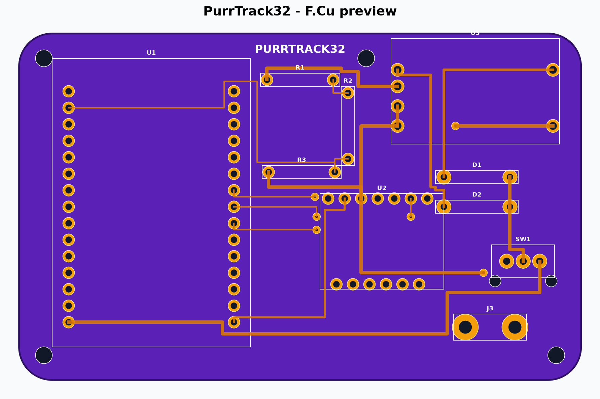
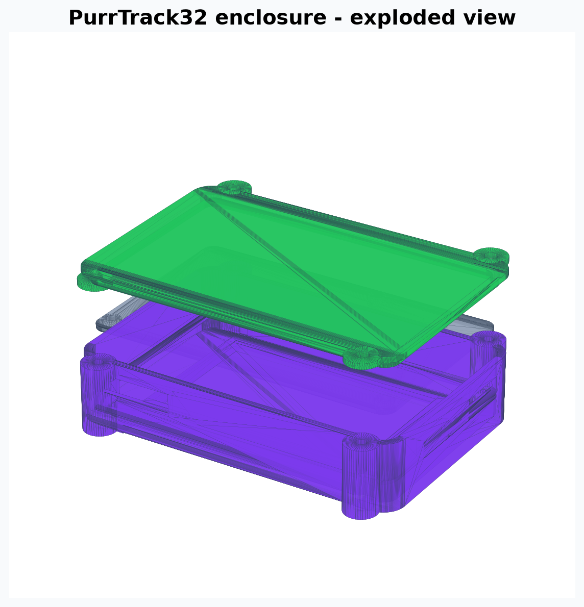

# PurrTrack32

PurrTrack32 is a **prototype** SlimeVR carrier and enclosure for the **ELEGOO ESP-WROOM-32 USB-C 30-pin development board** and the **SlimeVR MuMo V1.1 ICM-45686 + QMC6309 breakout**. Its rounded outline, clear assembly zones, paired 1N5817 charge diodes, through-hole construction, and 50 mm strap chassis are inspired by the meowCarrier approach while using a larger ESP32-specific layout.





## Important status

This package passed automated geometry, copper-clearance, Gerber-parsing, and watertight-mesh checks. It has **not** been fabricated or electrically bench-tested. Treat revision 0.2 as a prototype and inspect it in a Gerber viewer before ordering.

## Supported parts

- ELEGOO ESP-WROOM-32 USB-C, 30 pins, two 15-pin rows on 2.54 mm pitch and 25.4 mm row spacing.
- MuMo V1.1, 18 x 13 mm, 1.2 mm thick, with both the seven-pin `J1 TOP_PINS` edge and six-pin `J2 BOTTOM_PINS` edge fitted.
- Protected TP4056 USB-C single-cell charger module, nominally 26 x 17 mm, with `IN+`, `IN-`, `B+`, `B-`, `OUT+`, and `OUT-` pads.
- Two axial 1N5817 Schottky diodes.
- 180 kOhm, 220 kOhm, and 100 kOhm 1/4 W resistors. The three-resistor divider matches the current SlimeVR `BOARD_WROOM32` defaults and feeds GPIO36/VP.
- SK12D07/SK12D07VG high-3mm SPDT slide switch.
- One protected 3.7 V, one-cell LiPo up to approximately 64 x 42 x 7 mm; 503759 fits.

## JLCPCB files

Upload [`hardware/pcb/PurrTrack32_JLCPCB_Gerbers.zip`](hardware/pcb/PurrTrack32_JLCPCB_Gerbers.zip) directly to JLCPCB. Recommended prototype settings:

- 2 layers, 86.36 x 53.34 mm
- 1.0 mm FR-4
- Purple solder mask for the shown style, or green for the quickest fabrication
- Lead-free HASL
- 1 oz copper
- Remove order number: specify the bottom `JLCJLCJLCJLC` location if the ordering interface supports it

The design is through-hole/module assembled. `BOM.csv` is a purchasing list; `CPL.csv` intentionally contains no SMT placement data.

## MuMo and firmware wiring

The PCB is SPI-first:

| Signal | ESP32 | MuMo |
| --- | --- | --- |
| SCLK | GPIO18 | J1.4 SCL |
| MOSI | GPIO23 | J1.5 SDA |
| MISO | GPIO19 | J1.7 SDO |
| CS | GPIO5 | J1.6 CS |
| INT1 | GPIO17 | J2.3 INT1 |
| Power | 3V3 | J1.2 3V3 |
| Ground | GND | J1.3 GND |

The same SCL/SDA wires can be used for I2C if the MuMo jumpers are configured according to its official instructions. For SPI, use a custom SlimeVR build with the pins above and ICM-45686 selected. Do not assume a generic prebuilt WROOM32 image has this exact custom SPI map.

Battery monitoring uses GPIO36/VP and these firmware values, in kOhm:

```cpp
#define PIN_BATTERY_LEVEL 36
#define BATTERY_SHIELD_RESISTANCE 180
#define BATTERY_SHIELD_R2 220
#define BATTERY_SHIELD_R1 100
```

## Enclosure

Creality Print can import the STL files in `hardware/enclosure/`:

- `PurrTrack32_case_50mm_strap`: rounded chassis with ESP32 USB-C, charger USB-C, switch openings, and four reinforced screw bosses.
- `PurrTrack32_battery_separator_tray`: full insulating barrier between the LiPo and PCB, with PCB standoffs and a small wire slot.
- `PurrTrack32_screw_lid_M3`: positively retained lid with four 3.4 mm M3 clearance holes and a 0.20 mm-per-side alignment plug.

Use four **M3 x 10 mm thread-forming/self-tapping pan-head screws for plastic**. The case has 2.6 mm blind pilot holes, so the screw tips cannot reach the PCB or battery. Tighten only until the lid is seated; overtightening can strip printed threads. Do not use screws longer than 10 mm unless you first verify the remaining boss depth.

Starting Creality settings: 0.4 mm nozzle, 0.20 mm layers, four walls, five top/bottom layers, 35% gyroid infill, PLA+ or PETG. Print the case upright, the separator flat, and the lid with its large outer face on the build plate. If your printer runs tight, scale only the lid X/Y to 100.2% or lightly sand the alignment plug.

## Assembly safety

1. Do not attach the LiPo until every other part is soldered and inspected.
2. Verify `BAT+` and `BAT-` with a multimeter. Reversed LiPo polarity can cause fire.
3. Use only a protected one-cell LiPo and a TP4056 board that includes battery protection.
4. Confirm the TP4056 pad order against its seller diagram; visually similar boards can differ.
5. Check for shorts from `SYS_5V` to ground and from `3V3` to ground before inserting the ESP32 or MuMo.
6. The striped end of each 1N5817 goes to the PCB pad marked `K`.
7. Use USB-A-to-USB-C for inexpensive TP4056 modules unless the module explicitly supports USB-C-to-C charging.
8. Never charge an unattended or damaged LiPo, and do not wear the tracker while charging.

## Source and regeneration

- Editable PCB layout: `hardware/pcb/source/PurrTrack32.kicad_pcb`
- Dimension-controlled generator: `hardware/pcb/source/generate_project.py`
- Human-readable schematic: `hardware/pcb/schematic/PurrTrack32_schematic.pdf`
- Validation report: `VALIDATION.json`

Regenerate with Python 3.12 plus `numpy`, `shapely`, `trimesh`, `manifold3d`, `matplotlib`, `reportlab`, and `gerbonara`.

## References and attribution

- meowCarrier by Shine Bright (MIT): https://github.com/Shine-Bright-Meow/meowCarrier
- SlimeVR tracker documentation: https://docs.slimevr.dev/diy/tracker-schematics.html
- Official MuMo V1.1 schematic: https://docs.slimevr.dev/files/mumo-schematic-1.1.pdf
- SlimeVR firmware: https://github.com/SlimeVR/SlimeVR-Tracker-ESP

The PurrTrack32 scripts, PCB layout, documentation, and enclosure geometry are released under the MIT License. Third-party modules and reference projects retain their original licenses.
